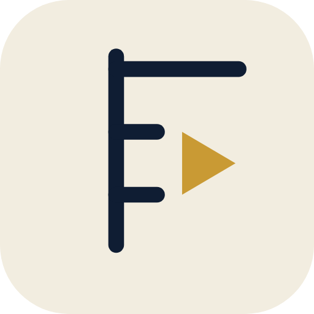

<p align="center">
  
</p>

<h1 align="center">Fathom</h1>

<p align="center">
  A YouTube and Bilibili player for Android, forked from <a href="https://github.com/A-EDev/Flow">Flow</a>,<br>
  with one library and recommendations that never leave the phone.
</p>

<p align="center">
  <b>Powered by FlowNeuro</b>, the on-device recommendation engine from Flow
</p>

<p align="center">
  Android 9+ · Kotlin · Jetpack Compose · GPL-3.0 · no account, no ads, no analytics
</p>

<p align="center">
  <b>English</b> · <a href="README.zh-TW.md">繁體中文</a>
</p>

---

## The short version

Fathom is a fork of Flow, a YouTube client with an on-device recommendation engine (FlowNeuro), that adds a second service. Bilibili videos, channels, comments, and danmaku sit next to YouTube's in search, the home feed, subscriptions, history, and playlists, and both feed the same local recommender.

Two things are added on top of upstream (the recommender itself is [FlowNeuro](#powered-by-flowneuro), unchanged in principle):

1. **A native Bilibili client**, written in Kotlin against Bilibili's web API. No web view, no extractor library.
2. **A local web server** on the phone, so any browser on the same network can search and play from your library.

Upstream keeps doing what it does. YouTube still runs on NewPipeExtractor, and the fork stays a small, mergeable diff.

<a id="powered-by-flowneuro"></a>
## Powered by FlowNeuro

Every recommendation in Fathom comes from **FlowNeuro**, the engine A-EDev built for Flow. It runs entirely on the device: no server, no account, no telemetry.

- Learns from what you watch, skip, like, dislike, and search for, and how long you stay
- Separates weekday from weekend and morning from night habits
- Notices when you are tired of a topic and mixes in something new, so the feed does not collapse into two or three subjects
- Turns recent watches into related-video transitions and filters low-quality videos by engagement ratios
- Shows what it knows and why it recommended something, and lets you edit, export, import, or wipe the profile

What this fork adds is reach: Bilibili watches, likes, and searches train the same profile as YouTube's, and titles in Chinese and Japanese are split into topics, so a mixed YouTube and Bilibili history still produces one coherent feed.

## What works where

| | YouTube | Bilibili |
|---|:---:|:---:|
| Search (videos, channels, playlists) | ✓ | ✓ |
| Home feed and related videos | ✓ | ✓ |
| Playback, quality, resume | ✓ | ✓ |
| Comments | ✓ | ✓ |
| Danmaku (bullet comments) | | ✓ |
| Subscriptions and feed refresh | ✓ | ✓ |
| Watch history, likes, playlists | ✓ | ✓ |
| Channel pages | ✓ | ✓ (uploads, series, seasons) |
| Open links from other apps | ✓ | ✓ |
| Local web server playback | ✓ | ✓ |
| Music, Shorts | ✓ | |
| Bangumi, live streams, paid content | | not yet |

Without a sign-in cookie Bilibili serves up to 1080p. An optional cookie of your own lifts that limit; nothing else needs an account.

## Opening Bilibili links

Set Flow to open supported links in Android's app settings, and these open directly in the app:

- `bilibili.com/video/BV…` (with `?p=` for multi-part videos)
- `space.bilibili.com/<uid>`
- `b23.tv/…` short links, including a whole shared text from Bilibili's share sheet

## Local web server

Turn it on and the phone serves a web app on port 8080. Open `http://<phone-ip>:8080` from a laptop, TV, or another phone on the same Wi-Fi.

- Search, channels, playlists, subscriptions, history, and watch-later, all backed by the app's own data
- A [Vidstack](https://vidstack.io) player over DASH: quality menu, chapters on the seek bar, thumbnail previews, subtitles, audio-only layout, keyboard and touch shortcuts, resume position
- YouTube and Bilibili both play, with the danmaku overlay for Bilibili
- Streams are proxied through the phone, so the other device needs nothing installed

The server began as [localtube](https://github.com/diekaiju/localtube) and was rebuilt around the native Bilibili client.

## Moving data in and out

- **Import** subscription JSON from NewPipe or PipePipe. Bilibili channels keep their service id (5) and get their avatars fetched.
- **Export** writes the same JSON, so it can go back into either app.
- Watch history and playlists come across from NewPipe backups. PipePipe's full backup ZIP is not read for subscriptions yet; use its subscription export instead.

## Features inherited from Flow

Everything upstream ships still applies: ExoPlayer playback with SponsorBlock, DeArrow, and Return YouTube Dislike; background play, picture-in-picture, casting; a music player with lyrics; Shorts; downloads; eleven themes; and the FlowNeuro transparency dashboard with exportable profiles. See [upstream's README](https://github.com/A-EDev/Flow#features) for the full list.

## Build

No signed releases are published. Build a debug APK:

```bash
git clone https://github.com/Chiehx0220/Flow.git
cd Flow
git checkout Btest
./gradlew assembleGithubDebug
```

Variants: the `foss` flavor drops the self-updater, and the `nightly` build type installs beside the debug build (`.nightly` suffix). Requires Android 9 (API 28) or newer to run.

## How the fork is organised

| Where | What |
|---|---|
| `bilibili/` | The Bilibili client: API, signing, sessions, comments, danmaku, ids, link parsing |
| `org/schabi/newpipe/localserver/` | The local web server and its Vidstack pages |
| upstream files | Small hooks only, mostly passing a service id through |

[FORK-DIFF.md](FORK-DIFF.md) is generated from `git diff upstream/main` (`node scripts/fork-diff.js`) and lists every upstream file the fork touches, which is where merge conflicts come from. `bilibili/PPE-REFERENCE.md` records which PipePipeExtractor revision the Bilibili client was ported from, so risk-control changes can be diffed and re-ported.

## Credits

- [**Flow**](https://github.com/A-EDev/Flow) by A-EDev: the app, the player, and FlowNeuro. Most of this project is theirs. If you want to support it, support them.
- [**PipePipeExtractor**](https://github.com/InfinityLoop1308/PipePipeExtractor) and [PipePipe](https://codeberg.org/NullPointerException/PipePipe) by InfinityLoop1308: the origin of the Bilibili client's request signing and session handling, and the source of service id 5.
- [**NewPipeExtractor**](https://github.com/TeamNewPipe/NewPipeExtractor): YouTube extraction.
- [**localtube**](https://github.com/diekaiju/localtube) by diekaiju: the local server's starting point.
- [**Vidstack**](https://vidstack.io) and [dash.js](https://github.com/Dash-Industry-Forum/dash.js): the web player.

## License

GPL-3.0, like upstream. Copyright © 2025–2026 A-EDev for Flow; modifications © 2026 Chiehx0220. Anything built on this code, including the FlowNeuro engine, must stay open source under the same license.
