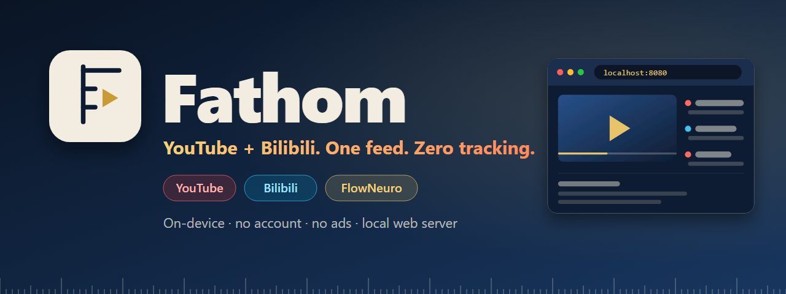

<p align="center">
  
</p>

<p align="center">
  <b>English</b> · <a href="README.zh-TW.md">繁體中文</a>
</p>

<p align="center">
  Android 9+ · Kotlin · Jetpack Compose · GPL-3.0<br>
  A fork of <a href="https://github.com/A-EDev/Flow">Flow</a> by A-EDev
</p>

---

## ⚡ In 10 seconds

- 📺 **YouTube and Bilibili in one app.** One search, one feed, one library.
- 🧠 **A recommender that lives on your phone.** Powered by [FlowNeuro](#-flowneuro). Nothing leaves the device.
- 🔒 **No account. No ads. No tracking.**
- 🌐 **Your phone is the server, so there is no desktop app to install.** Open the phone's address in any browser on your computer, instead of setting up a separate desktop client like [Flow-Desktop](https://github.com/Flow-Tube/Flow-Desktop).
- 🔗 **Bilibili links open in the app**, `b23.tv` short links included.

## 🧠 FlowNeuro

Every recommendation comes from **FlowNeuro**, A-EDev's on-device engine from Flow.

- Learns from watches, skips, likes, searches, and how long you stay
- Spots when you're bored of a topic and mixes in something new
- Shows exactly what it knows about you, and lets you edit, export, or wipe it

**What Fathom adds:** Bilibili watches train the same profile as YouTube's, and Chinese and Japanese titles are split into topics. Mixed history, one coherent feed.

## 🎬 Bilibili, natively

No web view. A Kotlin client talks to Bilibili's web API directly.

- Search, channels (uploads, series, seasons), playback, quality, multi-part videos
- Comments and 弹幕 danmaku
- Subscriptions, history, likes, playlists next to YouTube's

## 🌐 Local web server

Flow's desktop client is [Flow-Desktop](https://github.com/Flow-Tube/Flow-Desktop). This is the other way to use your library on a computer: turn the server on and open it in any browser, with no desktop app to download, install, or keep updated. Subscriptions, history, and watch-later are the app's own, because the phone serves them.

Turn it on and the phone serves a web app on port 8080.

- **On the phone itself:** `http://localhost:8080`
- **On any device on the same Wi-Fi:** `http://<phone-ip>:8080`, with nothing to install there

- Search, channels, playlists, subscriptions, history, watch-later
- A [Vidstack](https://vidstack.io) player: quality menu, chapters, seek-bar thumbnails, subtitles, audio-only mode, shortcuts, resume
- Plays YouTube and Bilibili, with danmaku

## 🔁 Bring your data

- **Import** NewPipe or PipePipe subscription JSON. Bilibili channels and avatars come along.
- **Export** the same JSON back to either app.

## 🛠 Build

```bash
git clone https://github.com/Chiehx0220/Flow.git
cd Flow && git checkout Btest
./gradlew assembleGithubDebug
```

No signed releases yet. Variants: `foss` (no updater), `nightly` (installs beside debug).

## 🧩 Under the hood

Paths are under `app/src/main/java/io/github/aedev/flow/`.

| Where | What |
|---|---|
| `bilibili/` | The client: API, request signing, sessions, comments, danmaku, ids, deep links |
| `data/paging/`, `player/stream/`, `ui/screens/playlists/` (`Bilibili*`) | Mappers and glue that plug it into search, playback, and playlists |
| `di/BilibiliModule.kt` | One shared session for the whole app |
| `localserver/` | The web server, its Bilibili adapters, and the phone remote |
| `assets/web/` | The classic web pages' stylesheets and scripts, as plain files |
| `assets/web/app/` | The new single-page web interface (`/app`): screens, focus engine, persistent player, themes, bundled fonts |
| about 90 upstream files | Small hooks, mostly passing a service id through |

The rule: new code goes in new files, and upstream files only get a call into it. That keeps merges from upstream small. [FORK-DIFF.md](FORK-DIFF.md) lists every upstream file touched (`node scripts/fork-diff.js`), and `bilibili/PPE-REFERENCE.md` records which PipePipeExtractor revision the client was ported from.

Everything else in Flow (SponsorBlock, DeArrow, music, Shorts, downloads, themes) is still here. See [upstream](https://github.com/A-EDev/Flow#features).

## 🙏 Credits

[Flow](https://github.com/A-EDev/Flow) and FlowNeuro by A-EDev · [PipePipeExtractor](https://github.com/InfinityLoop1308/PipePipeExtractor) by InfinityLoop1308 (Bilibili client origin) · [NewPipeExtractor](https://github.com/TeamNewPipe/NewPipeExtractor) · [localtube](https://github.com/diekaiju/localtube) by diekaiju · [Vidstack](https://vidstack.io) and [dash.js](https://github.com/Dash-Industry-Forum/dash.js)

## 📄 License

GPL-3.0. © 2025–2026 A-EDev (Flow); modifications © 2026 Chiehx0220. Code built on this, FlowNeuro included, must stay open source under the same license.
