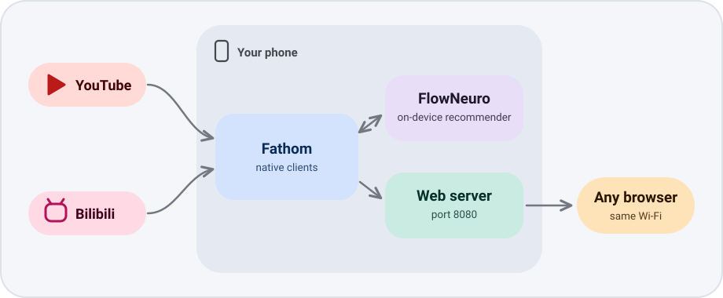

<p align="center">
  
</p>

<p align="center">
  <b>English</b> · <a href="README.zh-TW.md">繁體中文</a>
</p>

<p align="center">
  A fork of <a href="https://github.com/A-EDev/Flow">Flow</a> by A-EDev
</p>

<p align="center">
  
  
  
  
  <a href="https://github.com/A-EDev/Flow"></a>
  <a href="https://github.com/Chiehx0220/Fathom/releases"></a>
</p>

---

<table>
  <tr>
    <td width="33%"><b>📺 Two services, one app</b><br>YouTube and Bilibili share one search, one feed and one library.</td>
    <td width="33%"><b>🧠 Recommends on the phone</b><br>FlowNeuro learns from both services. Nothing leaves the device.</td>
    <td width="33%"><b>🔒 Nothing to sign up for</b><br>No account, no ads, no tracking.</td>
  </tr>
  <tr>
    <td><b>🎬 Native Bilibili</b><br>Search, playback, comments, danmaku and subscriptions. No web view.</td>
    <td><b>📡 Bilibili live rooms</b><br>Watch live streams with live chat, in the app and on the web page.</td>
    <td><b>🌐 Your phone is the server</b><br>Open it from any browser on your Wi-Fi, and steer it with your phone as a remote. No desktop app to install.</td>
  </tr>
</table>

## 📸 Screenshots

<table>
  <tr>
    <td width="25%" align="center"><br><sub>One feed for YouTube and Bilibili</sub></td>
    <td width="25%" align="center"><br><sub>Watch page</sub></td>
    <td width="25%" align="center"><br><sub>Bilibili live with danmaku</sub></td>
    <td width="25%" align="center"><br><sub>Phone as a remote control</sub></td>
  </tr>
</table>

## 🆚 What Fathom adds to Flow

| | Flow | Fathom |
|---|:---:|:---:|
| YouTube, FlowNeuro, SponsorBlock, downloads | ✅ | ✅ |
| Bilibili search, playback, comments, danmaku, live rooms | ❌ | ✅ |
| One recommender trained on both services | ❌ | ✅ |
| Web page served by the phone, no desktop app | ❌ | ✅ |
| Import and export NewPipe / PipePipe subscriptions | 🟡 | ✅ |

<sub>🟡 Flow can only import from NewPipe.</sub>

## 🏗 How it fits together

<p align="center">
  
</p>

## 🧠 FlowNeuro

Every recommendation comes from **FlowNeuro**, A-EDev's on-device engine from Flow.

- Learns from watches, skips, likes, searches, and how long you stay
- Spots when you're bored of a topic and mixes in something new
- Shows exactly what it knows about you, and lets you edit, export, or wipe it

**What Fathom adds:** Bilibili watches train the same profile as YouTube's, and Chinese and Japanese titles are split into topics. Mixed history, one coherent feed.

## 🎬 Bilibili, natively

No web view. A Kotlin client talks to Bilibili's web API directly.

- Search, channels (uploads, series, seasons), playback, quality, multi-part videos
- Comments and danmaku, the comments that scroll across the video
- Subscriptions, history, likes and playlists, alongside YouTube's

## 🌐 Local web server

To watch on a computer, you don't need to download [Flow-Desktop](https://github.com/Flow-Tube/Flow-Desktop), Flow's desktop client. Turn the server on and open it in any browser, with nothing to install or keep updated. Subscriptions, history, and watch-later come straight from the app.

Once it is on, the phone serves a web app on port 8080.

- **On the phone itself:** `http://localhost:8080`
- **On any device on the same Wi-Fi:** `http://<phone-ip>:8080`, with nothing to install there

In the web app:

- Search, channels, playlists, subscriptions, history, watch-later
- A [Video.js](https://videojs.org) 10 player, served from the device itself: quality menu, chapters, seek-bar thumbnails, subtitles, audio-only mode, shortcuts, resume
- YouTube and Bilibili playback, with danmaku

<p align="center">
  
</p>

> The web server and web page are inspired by [localtube](https://github.com/diekaiju/localtube) by diekaiju, rewritten for Fathom and extended with Bilibili.

### 🎮 Remote control

Away from the keyboard? Steer a Fathom screen from your phone instead.

- Arrow pad with OK, Back, Home and Options, plus a touchpad
- Playback controls, and shortcuts to Subscriptions and History
- Search by typing or by voice
- A YouTube / Bilibili switch

## 🔁 Bring your data

- **Import** NewPipe or PipePipe subscription JSON. Bilibili channels and avatars come along.
- **Export** the same JSON back to either app.

## 🛠 Build

```bash
git clone https://github.com/Chiehx0220/Fathom.git
cd Fathom
./gradlew assembleGithubDebug
```

No signed releases yet. Variants: `foss` (no updater), `nightly` (installs beside debug).

## 🧩 Under the hood

Paths are under `app/src/main/java/io/github/aedev/flow/`.

| Where | What |
|---|---|
| `bilibili/` | The client: API, request signing, sessions, live rooms, comments, danmaku, ids, deep links |
| `data/paging/`, `player/stream/`, `ui/screens/playlists/` (`Bilibili*`) | Mappers and glue that plug it into search, playback, and playlists |
| `di/BilibiliModule.kt` | One shared session for the whole app |
| `localserver/` | The web server, its Bilibili adapters, and the web player pages |
| about 110 upstream files | Small hooks, mostly passing a service id through |

The rule: new code goes in new files, and upstream files only get a call into it. That keeps merges from upstream small. [FORK-DIFF.md](FORK-DIFF.md) lists every upstream file touched (`node scripts/fork-diff.js`), and `bilibili/PPE-REFERENCE.md` records which PipePipeExtractor revision the client was ported from.

Everything else in Flow (SponsorBlock, DeArrow, music, Shorts, downloads, themes) is still here. See [upstream](https://github.com/A-EDev/Flow#features).

## 🙏 Credits

[Flow](https://github.com/A-EDev/Flow) and FlowNeuro by A-EDev · [PipePipeExtractor](https://github.com/InfinityLoop1308/PipePipeExtractor) by InfinityLoop1308 (the Bilibili client is based on it) · [NewPipeExtractor](https://github.com/TeamNewPipe/NewPipeExtractor) · [localtube](https://github.com/diekaiju/localtube) by diekaiju · [Video.js](https://videojs.org), [dash.js](https://github.com/Dash-Industry-Forum/dash.js) and [hls.js](https://github.com/video-dev/hls.js)

## 📄 License

Fathom is released under GPL-3.0. You are free to use, modify and share it, but any version you distribute must stay open source under the same license.

Flow, FlowNeuro included, is © 2025–2026 A-EDev. The changes and additions in Fathom are © 2026 Chiehx0220.
