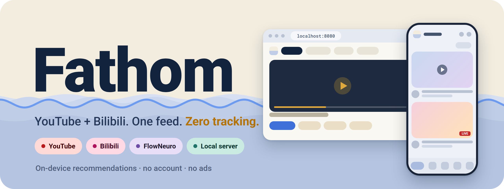
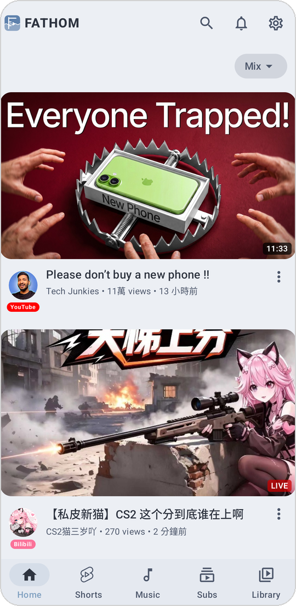
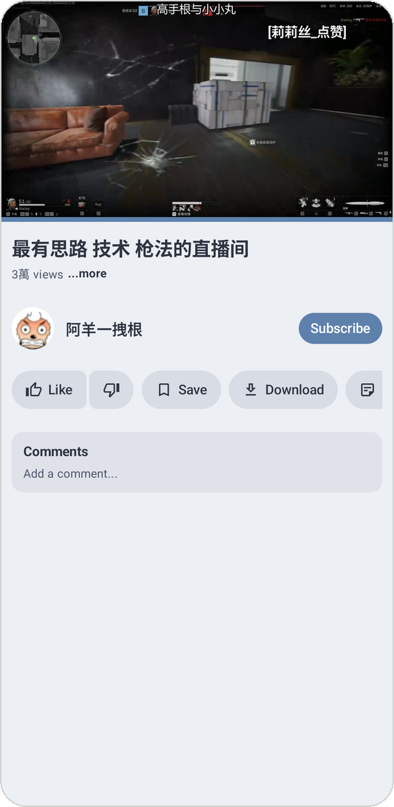
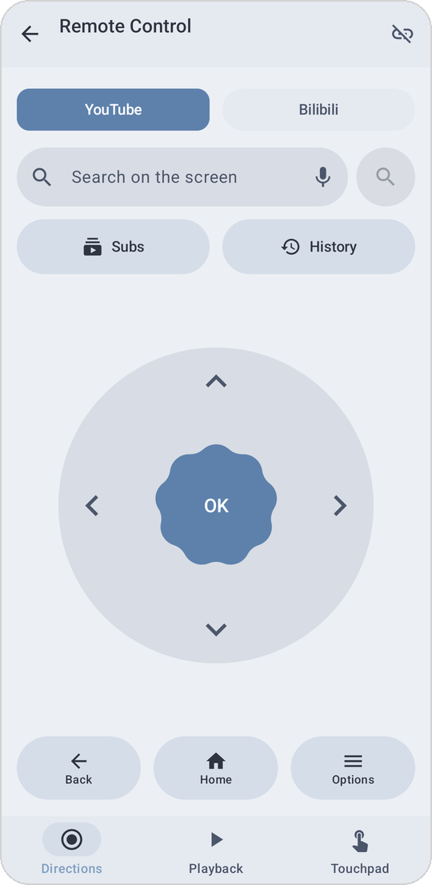
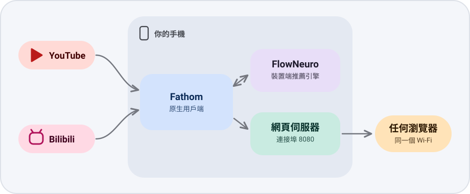
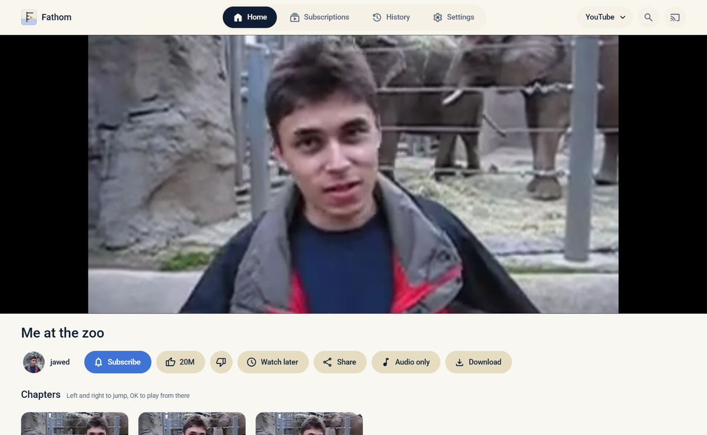

<p align="center">
  
</p>

<p align="center">
  <a href="README.md">English</a> · <b>繁體中文</b>
</p>

<p align="center">
  衍生自 A-EDev 的 <a href="https://github.com/A-EDev/Flow">Flow</a>
</p>

<p align="center">
  
  
  
  
  <a href="https://github.com/A-EDev/Flow"></a>
  <a href="https://github.com/Chiehx0220/Fathom/releases"></a>
</p>

---

<table>
  <tr>
    <td width="33%"><b>📺 兩個平台,一個 App</b><br>YouTube 與 Bilibili 共用同一個搜尋、首頁和媒體庫。</td>
    <td width="33%"><b>🧠 在手機上推薦</b><br>FlowNeuro 同時學習兩邊的觀看習慣,資料不會離開裝置。</td>
    <td width="33%"><b>🔒 免註冊</b><br>免登入、無廣告、不追蹤。</td>
  </tr>
  <tr>
    <td><b>🎬 原生 Bilibili</b><br>搜尋、播放、留言、彈幕、訂閱,不是內嵌網頁。</td>
    <td><b>📡 Bilibili 直播</b><br>可看直播與即時聊天,App 和網頁版都支援。</td>
    <td><b>🌐 手機就是伺服器</b><br>同一個 Wi-Fi 下任何瀏覽器都能開,還能用手機當遙控器,電腦不用裝程式。</td>
  </tr>
</table>

## 📸 截圖

<table>
  <tr>
    <td width="25%" align="center"><br><sub>YouTube 與 Bilibili 同一個首頁</sub></td>
    <td width="25%" align="center"><br><sub>播放頁</sub></td>
    <td width="25%" align="center"><br><sub>Bilibili 直播與彈幕</sub></td>
    <td width="25%" align="center"><br><sub>手機變遙控器</sub></td>
  </tr>
</table>

## 🆚 Fathom 比 Flow 多了什麼

| | Flow | Fathom |
|---|:---:|:---:|
| YouTube、FlowNeuro、SponsorBlock、下載 | ✅ | ✅ |
| Bilibili 搜尋、播放、留言、彈幕、直播 | ❌ | ✅ |
| 兩個平台共用同一個推薦引擎 | ❌ | ✅ |
| 由手機提供的網頁版,不必裝桌面程式 | ❌ | ✅ |
| 匯入、匯出 NewPipe / PipePipe 訂閱 | 🟡 | ✅ |

<sub>🟡 Flow 僅支援從 NewPipe 匯入。</sub>

## 🏗 運作方式

<p align="center">
  
</p>

## 🧠 FlowNeuro

所有推薦都由 **FlowNeuro** 產生。它是 A-EDev 為 Flow 開發的推薦引擎,直接在手機上運算。

- 從你的觀看、跳過、按讚、搜尋和停留時間學習喜好
- 發現你對某個主題看膩了,就改推其他內容
- 它記錄了哪些關於你的資料,你都看得到,並且能自行編輯、匯出或一鍵清除

**Fathom 新增的部分:** 在 Bilibili 看的內容會和 YouTube 一起訓練同一份個人檔案,中日文標題也能拆解出主題關鍵字。兩個平台的紀錄合在一起,推薦依然連貫。

## 🎬 原生 Bilibili

不是內嵌網頁。由 Kotlin 寫成的用戶端直接呼叫 Bilibili 的網頁 API。

- 搜尋、頻道(投稿、系列、合集)、播放、畫質切換、多分 P
- 留言與彈幕
- 訂閱、觀看紀錄、按讚和播放清單,與 YouTube 並列管理

## 🌐 本地網頁伺服器

想在電腦上看片,不必下載 Flow 的桌面版 [Flow-Desktop](https://github.com/Flow-Tube/Flow-Desktop)。開啟伺服器後,用任何瀏覽器就能看,不需要安裝或更新任何程式。訂閱、觀看紀錄和稍後觀看都直接取自 App。

開啟後,手機會在 8080 連接埠提供網頁版 App。

- **在手機上:** `http://localhost:8080`
- **同一個 Wi-Fi 下的任何裝置:** `http://<手機IP>:8080`,不需安裝任何東西

- 搜尋、頻道、播放清單、訂閱、觀看紀錄、稍後觀看
- [Video.js](https://videojs.org) 10 播放器(由裝置本身提供,不需要外部 CDN):畫質選單、章節、進度條縮圖、字幕、純音訊模式、快捷鍵、接續播放
- 支援 YouTube 和 Bilibili,Bilibili 也能顯示彈幕

<p align="center">
  
</p>

> 內建伺服器與網頁版的靈感來自 diekaiju 的 [localtube](https://github.com/diekaiju/localtube),在 Fathom 中重新撰寫並擴充了 Bilibili 支援。

### 🎮 用手機遙控

不想碰鍵盤和滑鼠?也可以直接用手機來操作 Fathom 的畫面。

- 方向鍵搭配確認、返回、首頁和選項,另有觸控板
- 播放控制,以及訂閱、觀看紀錄的捷徑
- 可用打字或語音搜尋
- 能切換 YouTube 與 Bilibili

## 🔁 搬移你的資料

- **匯入** NewPipe 或 PipePipe 的訂閱 JSON,Bilibili 頻道和頭像也會一起帶進來。
- **匯出**成相同格式的 JSON,可以再匯回這兩個 App。

## 🛠 建置

```bash
git clone https://github.com/Chiehx0220/Fathom.git
cd Fathom
./gradlew assembleGithubDebug
```

目前尚未提供已簽署的發行版。可選的建置變體:`foss`(不含自動更新)、`nightly`(可與 debug 版並存安裝)。

## 🧩 程式碼結構

路徑都在 `app/src/main/java/io/github/aedev/flow/` 底下。

| 位置 | 內容 |
|---|---|
| `bilibili/` | 用戶端本體:API、請求簽章、登入狀態、直播、留言、彈幕、影片 ID、連結開啟 |
| `data/paging/`、`player/stream/`、`ui/screens/playlists/`(`Bilibili*`) | 把 Bilibili 接進搜尋、播放和播放清單的轉換與銜接程式碼 |
| `di/BilibiliModule.kt` | 整個 App 共用同一個登入狀態 |
| `localserver/` | 網頁伺服器、Bilibili 轉接層,以及網頁播放器頁面 |
| 約 110 個上游檔案 | 小幅改動,多半只是多傳一個服務代碼 |

原則:新程式碼一律放在新檔案,上游檔案只加一行呼叫,這樣同步上游時衝突會少很多。[FORK-DIFF.md](FORK-DIFF.md) 列出所有改動過的上游檔案(由 `node scripts/fork-diff.js` 產生);`bilibili/PPE-REFERENCE.md` 記錄用戶端是從 PipePipeExtractor 的哪個版本移植而來。

Flow 原有的功能(SponsorBlock、DeArrow、音樂、Shorts、下載、主題)全部保留,詳見[上游說明](https://github.com/A-EDev/Flow#features)。

## 🙏 致謝

[Flow](https://github.com/A-EDev/Flow) 與 FlowNeuro,A-EDev · [PipePipeExtractor](https://github.com/InfinityLoop1308/PipePipeExtractor),InfinityLoop1308(Bilibili 用戶端以它為基礎) · [NewPipeExtractor](https://github.com/TeamNewPipe/NewPipeExtractor) · [localtube](https://github.com/diekaiju/localtube),diekaiju · [Video.js](https://videojs.org)、[dash.js](https://github.com/Dash-Industry-Forum/dash.js) 與 [hls.js](https://github.com/video-dev/hls.js)

## 📄 授權

Fathom 以 GPL-3.0 授權釋出。你可以自由使用、修改和分享,但只要公開發佈,就必須連同原始碼一併開放,並沿用相同的授權。

Flow(含 FlowNeuro)© 2025–2026 A-EDev;Fathom 修改與新增的部分 © 2026 Chiehx0220。
